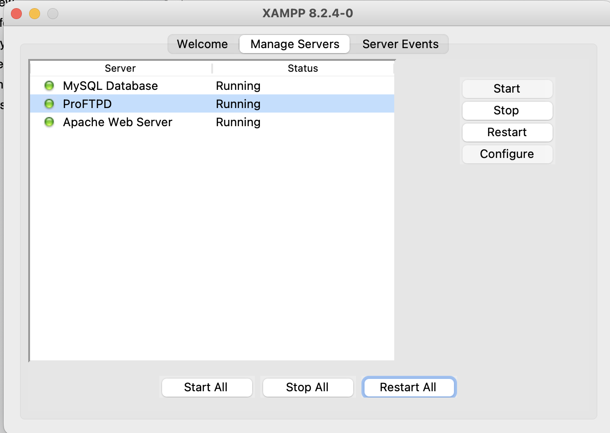

# Step by step

## XAMPP Install

*"XAMPP is one of the widely used cross-platform web servers, which helps developers to create and test their programs on a local webserver."*

*"**XAMPP is the most popular PHP development environment**. XAMPP is a completely free, easy to install Apache distribution containing MariaDB, PHP, and Perl. The XAMPP open source package has been set up to be incredibly easy to install and to use."*

Here you can download it: https://www.apachefriends.org/

## Configuration

Now you can clone the repository. **IMPORTANT:** You will have to place the folder inside the "Applications/XAMPP/htdocs/" directory. This is very important in order to Apache finds the project.

Also, you may have to edit the server configuration. You should go to "Applications/XAMPP/etc/" and open "php.ini". Here you must change the following:

```
short_open_tag=Off
...
display_errors=Off
...
date.timezone=Europe/Berlin
```
To:
```
short_open_tag=On
...
display_errors=On
...
date.timezone=UTC
```

## Deploy
Once everything setted up, you should click "Start All" in the XAMPP snippet:



Now you are able to see the project preview: http://localhost/Braze-with-php-demo/index.php